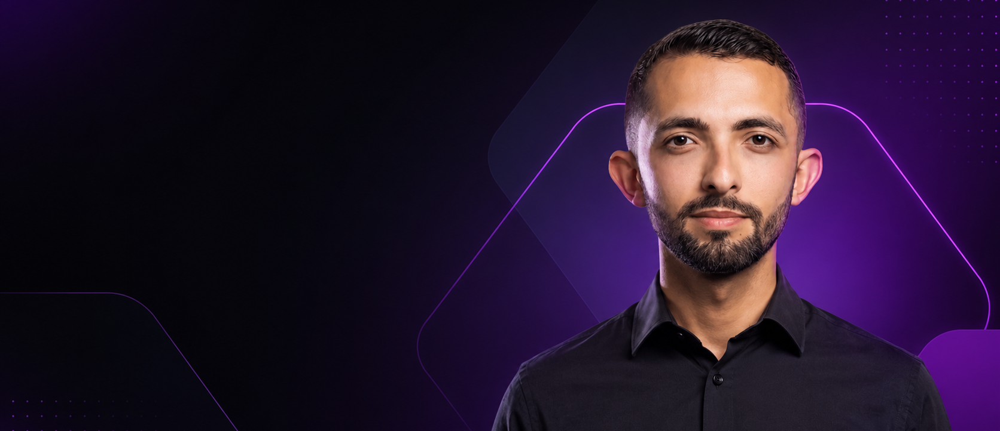

# Renato Queiroga | Portfólio Full Stack




> Soft skills de educador, hard skills de engenheiro. Este é meu portfólio pessoal — uma landing page moderna construída primeiro com HTML, CSS e JavaScript puro, depois migrada para Next.js, React, TypeScript e Tailwind CSS.

---

## Sobre o Projeto

Este projeto segue uma filosofia que considero essencial: **dominar os fundamentos antes de abraçar frameworks**.

Por isso, ele existe em **duas versões**:

| Versão | Stack | Link |
|--------|-------|------|
| **Vanilla** | HTML, CSS, JavaScript puro | [Ver demo](https://rehqueirog.github.io/p1-landing-page-vanilla/) |
| **Moderna** | Next.js, React, TypeScript, Tailwind | [Ver demo](https://p1-landing-page-stack.vercel.app/) |

A versão Vanilla foi construída primeiro — cada linha de HTML semântico, cada regra CSS com design tokens e cada função JavaScript pura. Depois, migrei o mesmo projeto para a stack moderna, componente por componente.

---

## Seções do Site

- **Hero Section** — Proposta de valor e CTAs
- **Features Grid** — 6 cards com minhas especialidades
- **Pricing Table** — 3 planos de serviço
- **FAQ Accordion** — Perguntas frequentes com animação
- **Footer** — Navegação secundária e copyright
- **Back to Top** — Botão flutuante com scroll suave

---

### Ajustes e Melhorias

O projeto está em constante evolução:

- [x] HTML semântico e CSS com design tokens
- [x] JavaScript puro (DOM, eventos, accordion)
- [x] Migração para Next.js + TypeScript
- [x] Migração CSS para Tailwind
- [x] Responsivo (mobile, tablet, desktop)
- [x] README profissional
- [x] Deploy na Vercel e GitHub Pages
- [ ] Adicionar blog com Next.js
- [ ] Integração com API de contato

---

## Tecnologias (Versão Moderna)

- **Next.js 16** — Framework React com SSR e SEO
- **React 19** — Componentização e hooks
- **TypeScript 5** — Tipagem estática
- **Tailwind CSS 4** — Utility-first com design tokens
- **Boxicons** — Biblioteca de ícones

---

## Pré-requisitos

Antes de começar, verifique se você tem:

- [Node.js](https://nodejs.org/) 18+ instalado
- [pnpm](https://pnpm.io/) instalado (`npm install -g pnpm`)
- Um navegador moderno (Chrome, Firefox, Edge)

---

## Como Rodar Localmente

```bash
git clone https://github.com/rehqueirog/p1-landing-page-stack.git
cd p1-landing-page-stack
pnpm install
pnpm dev
```

---

## Estrutura do Projeto (Versão Moderna)

```
src/
├── app/
│   ├── globals.css          # Tokens de design + reset + scrollbar
│   ├── layout.tsx           # Metadados SEO + estrutura fixa
│   └── page.tsx             # Montagem dos componentes
│
└── components/
    ├── Navbar.tsx            # Navegação desktop + mobile
    ├── Hero.tsx              # Seção principal com gradiente
    ├── Features.tsx          # Grid de especialidades
    ├── Pricing.tsx           # Tabela de planos
    ├── Faq.tsx               # Accordion de dúvidas
    ├── Footer.tsx            # Rodapé com links
    └── BackToTop.tsx         # Botão voltar ao topo
```

---

## O Que Aprendi Neste Projeto

- Construir uma landing page do zero com HTML semântico
- Criar um design system com CSS custom properties
- Implementar interatividade com JavaScript puro
- Migrar para React/Next.js componente por componente
- Substituir CSS tradicional por Tailwind CSS
- Usar TypeScript para segurança e autocompletar
- Configurar pnpm para economia de espaço

---

## Deploy

Stack Moderna: [p1-landing-page-stack](https://github.com/rehqueirog/p1-landing-page-stack)  
Vanilla: [p1-landing-page-stack.vercel.app](https://p1-landing-page-stack.vercel.app/)

---

## Contribuindo

1. Este é um projeto pessoal de portfólio, mas sugestões são bem-vindas!
2. Faça um fork do projeto
3. Crie um branch: git checkout -b minha-sugestao
4. Faça suas alterações e confirme: git commit -m 'Sugestão: ...'
4. Envie para o branch original: git push origin minha-sugestao
5. Abra um Pull Request

---

## Autor

Renato Queiroga — Desenvolvedor Full Stack

<table> <tr> <td align="center"> <a href="https://www.linkedin.com/in/renato-queiroga-024899411/" title="LinkedIn"> <br> <sub><b>LinkedIn</b></sub> </a> </td> <td align="center"> <a href="https://github.com/rehqueirog" title="GitHub"> <br> <sub><b>GitHub</b></sub> </a> </td> <td align="center"> <a href="https://www.instagram.com/renatoqueirog/" title="Instagram"> <br> <sub><b>Instagram</b></sub> </a> </td> <td align="center"> <a href="https://wa.me/5583982033982" title="WhatsApp"> <br> <sub><b>WhatsApp</b></sub> </a> </td> </tr> </table>

---

## Licença

MIT. Sinta-se livre para usar como inspiração.

> [!TIP]
> Este projeto é a prova de que fundamentos sólidos + stack moderna = desenvolvedor completo.